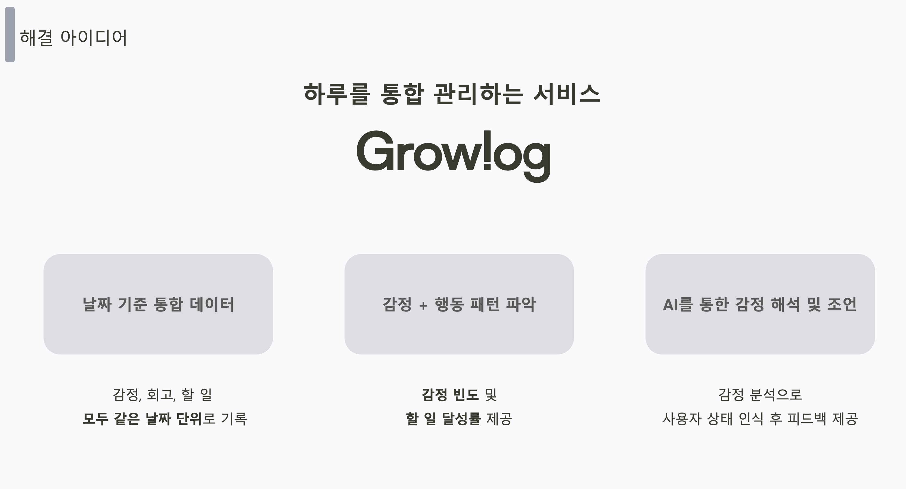
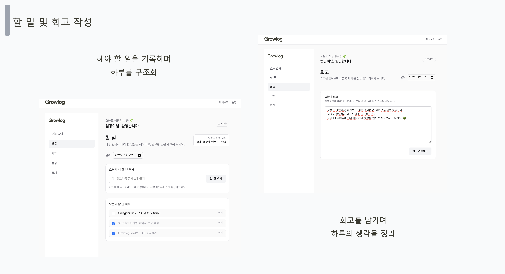
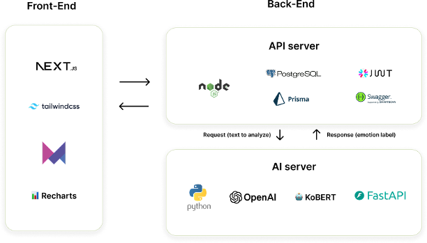

# ⚙️ Growlog Backend

> 감정 기록 기반 자기 관리 서비스 **Growlog의 API 서버**

Growlog Backend는  
사용자의 **할 일, 감정 기록, 회고 데이터**를 관리하고  
AI 감정 분석 서버와 연동하여 데이터를 제공하는 API 서버입니다.

Frontend 서비스와 AI 분석 서버 사이에서  
**데이터 관리와 서비스 로직을 담당합니다.**

---

# 📌 Project Overview

Growlog는 사용자의 하루를

- 할 일 기록
- 감정 기록
- 회고 작성

으로 구조화하여  
**행동과 감정 데이터를 함께 관리하는 자기 관리 서비스**입니다.

Backend 서버는 다음 역할을 수행합니다.

- 사용자 데이터 관리
- 할 일 관리 API
- 감정 기록 API
- 회고 데이터 관리
- AI 감정 분석 서버 연동

---

# 🎯 Why This Project

기존 Todo 서비스는 대부분

- 할 일 관리
- 일정 관리

기능에 집중되어 있습니다.

Growlog는 여기에

**감정 기록과 회고 데이터를 함께 관리하여  
사용자의 행동과 감정 흐름을 분석할 수 있도록 설계된 서비스입니다.**

Backend 서버는

- 사용자 데이터 관리
- 감정 데이터 저장
- AI 분석 데이터 연동

을 담당합니다.

---

# 🧩 Key Features

### 할 일 관리 API



- 오늘 할 일 추가
- 할 일 완료 체크
- 할 일 삭제
- 진행률 계산

---

### 감정 기록 API 및 AI 감정 분석


사용자는 하루에 한 번 감정을 기록할 수 있습니다.
또한 AI 서버와 통신하여  
감정 분석 데이터를 받아옵니다.

- 감정 선택
- 감정 메모 작성
- 감정 데이터 저장
- 감정 데이터 긍정, 중립, 부정 분석

---

### 회고 기록 API


하루를 돌아보며 회고를 기록할 수 있습니다.

- 하루 회고 작성
- 날짜별 회고 조회

---

### 통계 데이터 제공


Backend는 다음 데이터를 계산합니다.

- 주간 감정 분포
- 할 일 완료율
- 감정 기록 통계

Frontend에서 시각화할 수 있도록 제공합니다.

---

# 🏗 System Architecture



Growlog 서비스는 다음 구조로 구성됩니다.


Frontend
↓
Backend API Server
↓
Database
↓
AI Server (FastAPI)


Backend는

- 데이터 관리
- AI 서버 연동
- API 제공

역할을 담당합니다.

---

# ⚙️ Tech Stack

### Backend

- Node.js
- Express

### Database

- PostgreSQL
- Prisma ORM

### API

- REST API
- Swagger

---

# 📂 Project Structure

```markdown
```text
growlog-backend
├── src
│   ├── controllers
│   ├── routes
│   ├── services
│   ├── middlewares
│   └── utils
├── prisma
│   └── schema.prisma
├── config
└── app.js
```

---

## 🚀 Future Improvements

- 사용자 인증 시스템 개선

- 감정 데이터 기반 추천 기능

- 장기 감정 패턴 분석

- 알림 및 루틴 기능

---

## 🌱 Growlog Ecosystem

Growlog 서비스는 다음 세 가지 시스템으로 구성됩니다.

**Frontend**  
사용자 인터페이스 및 데이터 시각화

**Backend**  
데이터 관리 및 API 서버

**AI Server**  
감정 분석 및 AI 피드백 제공

이 구조를 통해 사용자의 행동 데이터와 감정 데이터를 연결하여  
자기 관리 패턴을 분석하는 서비스를 구현합니다.

---
